# MuJoCo vs Isaac Sim Pipeline Comparison

## Overview

This document compares the **MuJoCo pipeline** (what you learned in this project) with the **Isaac Sim pipeline** (your next learning goal), highlighting key differences.

---

## Side-by-Side Comparison

```mermaid
graph LR
    subgraph MuJoCo["🔵 MuJoCo Pipeline (Current Project)"]
        M1["Phase 1<br/>Data Collection<br/>────────<br/>• Scripted policy<br/>• Simple sim<br/>• Fast iteration"]
        M2["Phase 2<br/>Training<br/>────────<br/>• ACT Policy<br/>• 30k steps<br/>• LeRobot"]
        M3["Phase 3<br/>Deployment<br/>────────<br/>• Sim deploy<br/>• Evaluation<br/>• Same env"]
        M1 --> M2 --> M3
    end
    
    subgraph Isaac["🔴 Isaac Sim Pipeline (Next Goal)"]
        I1["Phase 1<br/>Data Collection<br/>────────<br/>🔴 Photorealistic<br/>🔴 Physics accurate<br/>🔴 Domain rand"]
        I2["Phase 2<br/>Training<br/>────────<br/>• ACT Policy<br/>• 30k steps<br/>• LeRobot"]
        I3["Phase 3<br/>Deployment<br/>────────<br/>🔴 Real robot<br/>🔴 Sim-to-real<br/>🔴 Real camera"]
        I1 --> I2 --> I3
    end
```



---

## Detailed Phase-by-Phase Comparison

### Phase 1: Data Collection

| Aspect | MuJoCo (Current) | Isaac Sim (Future) |
|--------|------------------|---------------------|
| **Simulation** | Simple, fast physics | 🔴 **Photorealistic rendering** |
| **Visual Fidelity** | Basic shapes | 🔴 **RTX ray tracing, realistic lighting** |
| **Physics** | Basic contact | 🔴 **PhysX 5, more accurate dynamics** |
| **Data Type** | Synthetic (simple) | 🔴 **Synthetic (photorealistic)** |
| **Domain Randomization** | ❌ Not used | 🔴 **✅ Randomize lighting, textures, noise** |
| **Sensors** | Single camera | 🔴 **Multiple cameras, depth, segmentation** |
| **Performance** | Very fast (~500 FPS) | 🔴 **Slower (~30-60 FPS real-time)** |
| **Purpose** | Quick prototyping | 🔴 **Sim-to-real transfer** |

**Key Difference:** Isaac Sim data is designed to **transfer to real robots** via photorealism and domain randomization.

---

### Phase 2: Training

| Aspect | MuJoCo (Current) | Isaac Sim (Future) |
|--------|------------------|---------------------|
| **Policy** | ACT (Action Chunking) | ✅ **Same - ACT works with both** |
| **Framework** | LeRobot | ✅ **Same - LeRobot supports Isaac** |
| **Training Steps** | 30k steps | ✅ **Similar (may need more data)** |
| **Data Format** | Parquet + MP4 | ✅ **Same format** |
| **Augmentation** | None | 🔴 **May add image augmentation** |

**Key Difference:** Training process is **largely the same**, but Isaac Sim may benefit from more diverse data.

---

### Phase 3: Deployment

| Aspect | MuJoCo (Current) | Isaac Sim (Future) |
|--------|------------------|---------------------|
| **Target** | Simulation only | 🔴 **Real physical robot** |
| **Sim-to-Real Gap** | ❌ N/A | 🔴 **Major challenge to overcome** |
| **Camera** | Simulated camera | 🔴 **Real RGB camera (Intel RealSense, etc.)** |
| **Latency** | Zero | 🔴 **Real-world latency (50-100ms)** |
| **Safety** | No risk | 🔴 **Requires safety limits, collision avoidance** |
| **Calibration** | None needed | 🔴 **Camera-robot calibration required** |
| **Success Criteria** | Sim evaluation | 🔴 **Real-world task completion** |

**Key Difference:** Isaac Sim enables **real robot deployment**, the ultimate goal of robot learning.

---

## What You Learned from MuJoCo

✅ **Transferable Skills:**
1. **Data pipeline** - Recording, converting, managing episodes
2. **ACT policy** - Understanding transformer-based imitation learning
3. **LeRobot** - Dataset format, training scripts, evaluation
4. **Debugging** - Action normalization, image preprocessing, state mapping
5. **End-to-end pipeline** - Data → Training → Deployment flow

🔴 **Skills You'll Gain with Isaac Sim:**
1. **Photorealistic simulation** - NVIDIA Omniverse, RTX rendering
2. **Domain randomization** - Making policies robust to real-world variation
3. **Sim-to-real transfer** - Bridging the reality gap
4. **Real robot integration** - ROS 2, camera calibration, hardware control
5. **Production deployment** - Safety, latency, robustness

---

## Isaac Sim Pipeline Preview

### Phase 1: Synthetic Data Generation (Isaac Sim)
```bash
# Step 1: Launch Isaac Sim with robot scene
./isaac-sim.sh --/persistent/isaac/asset_root/default=/path/to/assets

# Step 2: Record with domain randomization
python isaac_record_episodes.py \
  --num_episodes 100 \
  --randomize_lighting true \
  --randomize_textures true \
  --randomize_camera_pose true
```

**Output:** High-quality synthetic data designed for real-world transfer

---

### Phase 2: Training (Same as MuJoCo!)
```bash
# Training process is identical
python scripts/train_policy.py
```

**Key insight:** Your MuJoCo training knowledge **directly transfers** to Isaac Sim!

---

### Phase 3: Sim-to-Real Deployment
```bash
# Step 1: Calibrate camera-robot transform
python calibrate_camera.py

# Step 2: Deploy to real robot
python deploy_to_real_robot.py \
  --camera_device /dev/video0 \
  --robot_ip 192.168.1.100
```

**Output:** Policy runs on physical hardware with real camera input

---

## Migration Path: MuJoCo → Isaac Sim

### Option 1: Gradual Migration
1. **Keep current MuJoCo setup** for rapid prototyping
2. **Add Isaac Sim** for final sim-to-real validation
3. Use MuJoCo for initial experiments, Isaac Sim for deployment

### Option 2: Full Migration
1. **Recreate scene in Isaac Sim** (Trossen arm + pick-place task)
2. **Add domain randomization** (lighting, textures, noise)
3. **Record new dataset** with photorealistic rendering
4. **Retrain policy** (same ACT/LeRobot workflow)
5. **Deploy to real robot**

---

## Recommended Next Steps

1. **Install NVIDIA Isaac Sim** (requires NVIDIA GPU)
2. **Complete Isaac Sim tutorials** on robot manipulation
3. **Port your MuJoCo scene** to Isaac Sim
4. **Add domain randomization** to improve sim-to-real transfer
5. **Acquire physical Trossen arm** for real deployment

---

## Summary

| What MuJoCo Taught You | What Isaac Sim Adds |
|------------------------|---------------------|
| ✅ Data pipeline basics | 🔴 Photorealistic data for sim-to-real |
| ✅ ACT policy training | ✅ Same training process |
| ✅ Simulation evaluation | 🔴 Real robot deployment |
| ✅ Fast iteration | 🔴 Production-ready transfer |

**Bottom line:** MuJoCo gave you the **fundamentals**. Isaac Sim adds the **realism needed for real robots**.

Your MuJoCo knowledge is **directly applicable** to Isaac Sim - you're well-prepared for the next step! 🚀
