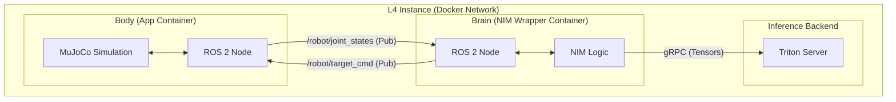

# Distributed ROS 2 & NIM Architecture

## Overview

We have evolved our inference stack into a **Distributed ROS 2 Architecture**.
-   **The Body**: The MuJoCo simulation now runs as a ROS 2 Node (`trossen_body`).
-   **The Brain**: The NIM Wrapper now runs as a ROS 2 Node (`nim_brain`).
-   **The Engine**: NVIDIA Triton Inference Server handles the heavy lifting (GPU inference).

### Why this architecture?

1.  **Standard Robotics Protocol**: By speaking **ROS 2** (DDS/RTPS) instead of custom HTTP/JSON, we align with the industry standard.
2.  **Location transparency**: The "Brain" can be on the same L4 instance, or on a remote Jetson Orin on a real robot. The "Body" just publishes to a topic and doesn't care.
3.  **Asynchronous Control**: The Pub/Sub model decouples the simulation loop (50Hz) from the inference latency.

## Architecture Diagram



## Implementation Details

### 1. The Brain Node (`nim_wrapper/main.py`)
A `rclpy` node that bridges ROS 2 topics to Triton.
-   **Subscriber**: `/robot/joint_states` (sensor_msgs/JointState)
-   **Publisher**: `/robot/target_cmd` (std_msgs/Float32MultiArray)
-   **Logic**:
    1.  Receives Joint State.
    2.  Preprocesses data (normalizes, potentially adds dummy image if camera not active).
    3.  Calls Triton via gRPC.
    4.  Publishes Policy Action.

### 2. The Body Node (`scripts/ros_sim_bridge.py`)
A `rclpy` node that wraps the MuJoCo Gym Environment.
-   **Publisher**: `/robot/joint_states` (Current position/velocity)
-   **Subscriber**: `/robot/target_cmd` (Next desired position)
-   **Logic**:
    -   Runs simulation loop at fixed frequency (e.g., 50Hz).
    -   Applies `last_received_action` to physics.
    -   Publishes new state.

### 3. Deployment
All services run in a unified `docker-compose.yml` network with `ROS_DOMAIN_ID=42`.

```yaml
  nim-wrapper:
    image: ros:humble-ros-base
    command: python3 -u main.py
    environment:
      - TRITON_URL=triton:8001
      - ROS_DOMAIN_ID=42
```

## Moving to Production (Real Robot)

To switch from *Simulation* to *Real World*:
1.  **Stop** the `trossen-app` container (The Sim Body).
2.  **Start** your real robot driver (e.g., `interbotix_xs_driver`).
3.  Ensure the real driver publishes `/robot/joint_states` and accepts `/robot/target_cmd`.
4.  The "Brain" (NIM Wrapper) needs **zero changes**. It just sees topics on the network.
